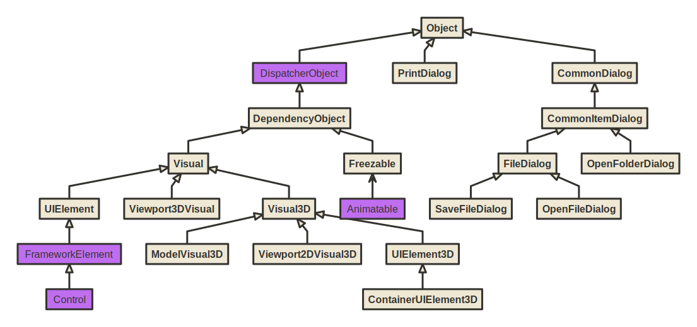
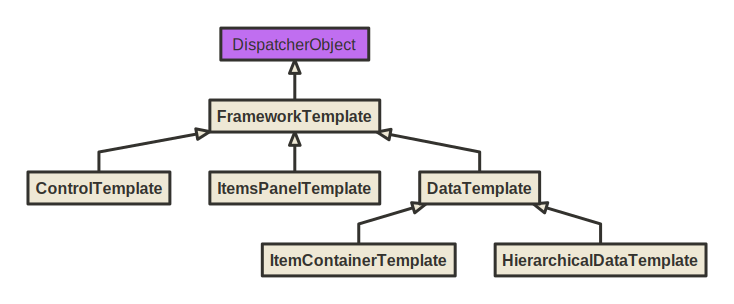
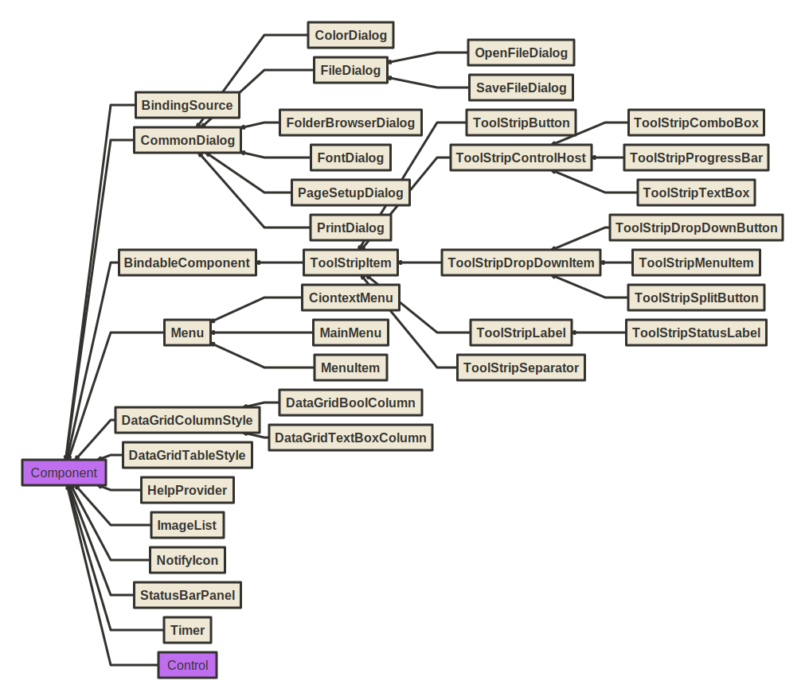
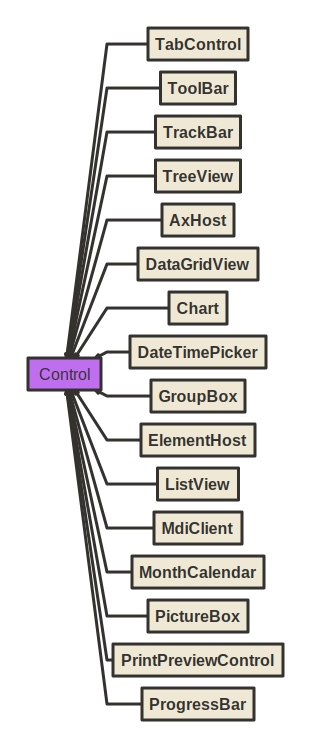
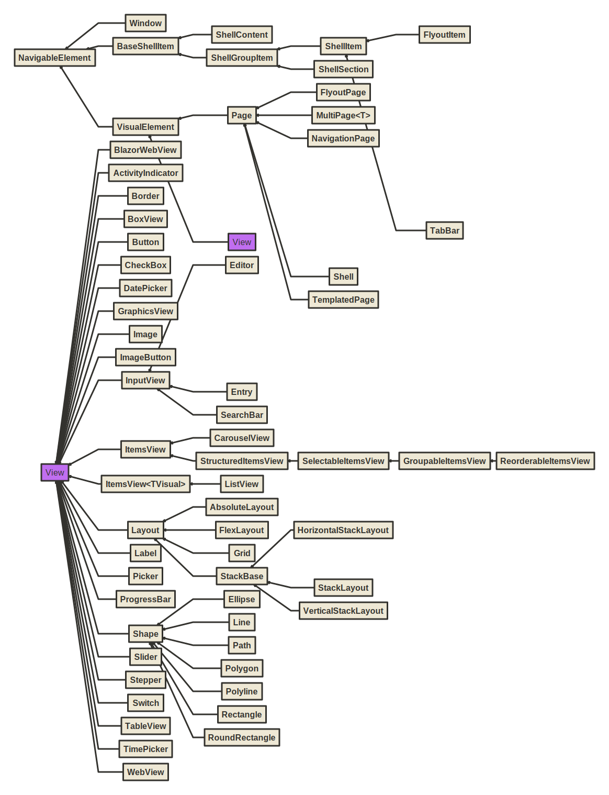

# UI

* **Windows Forms**

    Windows Forms is a UI framework for building Windows desktop apps. It provides one of the most productive ways to create desktop apps based on the visual designer provided in Visual Studio. Functionality such as drag-and-drop placement of visual controls makes it easy to build desktop apps.

* **WPF**

    Windows Presentation Foundation (WPF) is a UI framework that is resolution-independent and uses a vector-based rendering engine, built to take advantage of modern graphics hardware. WPF provides a comprehensive set of application-development features that include Extensible Application Markup Language (XAML), controls, data binding, layout, 2D and 3D graphics, animation, styles, templates, documents, media, text, and typography. WPF is part of .NET, so you can build applications that incorporate other elements of the .NET API.

* **MAUI**

    .NET Multi-platform App UI (.NET MAUI) is a cross-platform framework for creating native mobile and desktop apps with C# and XAML. Using .NET MAUI, you can develop apps that can run on Android, iOS, macOS, and Windows from a single shared code-base.

## MVVM

The MVVM pattern helps cleanly separate an application's business and presentation logic from its user interface (UI). Maintaining a clean separation between application logic and the UI helps address numerous development issues and makes an application easier to test, maintain, and evolve. It can also significantly improve code re-use opportunities and allows developers and UI designers to collaborate more easily when developing their respective parts of an app.
    
Frameworks:

* CommunityToolkit.Mvvm - https://learn.microsoft.com/en-us/dotnet/communitytoolkit/mvvm/
* ReactiveUI - https://www.reactiveui.net/
* Prism Libary - https://prismlibrary.com/

^^^

^^^ MVVM Data flow

### Minimal MVVM Implementation

```csharp
public abstract class ViewModelBase : INotifyPropertyChanged
{
    public event PropertyChangedEventHandler? PropertyChanged;

    protected void OnPropertyChanged(string propertyName = "") 
        => PropertyChanged?.Invoke(this, new PropertyChangedEventArgs(propertyName));

    protected void SetValue<T>(ref T field,
                               T newValue,
                               [CallerMemberName] string properyName = "")
    {
        if (!EqualityComparer<T>.Default.Equals(field, newValue))
        {
            field = newValue;
            OnPropertyChanged(properyName);
        }
    }

    protected void SetValue<T>(ref T field,
                               T newValue,
                               IEqualityComparer<T> comparer,
                               [CallerMemberName] string properyName = "")
    {
        if (!comparer.Equals(field, newValue))
        {
            field = newValue;
            OnPropertyChanged(properyName);
        }
    }
}
```

```csharp
public class RelayCommand : ICommand
{
    private readonly Action<object?> _acton;
    private readonly Predicate<object?>? _canExecute;

    public event EventHandler? CanExecuteChanged;

    public RelayCommand(Action<object?> acton, Predicate<object?>? canExecute = null)
    {
        _acton = acton;
        _canExecute = canExecute;
    }

    public void RaiseCanExecuteChanged()
        => CanExecuteChanged?.Invoke(this, EventArgs.Empty);

    public bool CanExecute(object? parameter)
        => _canExecute == null || _canExecute(parameter);

    public void Execute(object? parameter)
        => _acton.Invoke(parameter);
}
```

## WPF class hierarchy



* **DispatcherObject**

	Represents an object that is associated with a Dispatcher. The Dispatcher Provides services for managing the queue of work items for a thread.
	
* **DependencyObject**

	Represents an object that participates in the dependency property system.
	
* **Visual**

	Provides rendering support in WPF, which includes hit testing, coordinate transformation, and bounding box calculations.
	
* **UIElement**

	UIElement is a base class for WPF core level implementations building on Windows Presentation Foundation (WPF) elements and basic presentation characteristics.
	
* **FrameworkElement**

	Provides a WPF framework-level set of properties, events, and methods for Windows Presentation Foundation (WPF) elements. This class represents the provided WPF framework-level implementation that is built on the WPF core-level APIs that are defined by UIElement.
	
* **Control**

	Represents the base class for user interface (UI) elements that use a ControlTemplate to define their appearance.

* **Freezable**

	Defines an object that has a modifiable state and a read-only (frozen) state. Classes that derive from Freezable provide detailed change notification, can be made immutable, and can clone themselves.

* **Animatable**

	Abstract class that provides animation support.
	
* **Visual3D**

	Provides services and properties that are common to visual 3-D objects, including hit-testing, coordinate transformation, and bounding box calculations.



* **ControlTemplate**

	Specifies the visual structure and behavioral aspects of a Control that can be shared across multiple instances of the control.
	
* **ItemsPanelTemplate**

	Specifies the panel that the ItemsPresenter creates for the layout of the items of an ItemsControl.
	
* **DataTemplate**

	Describes the visual structure of a data object.
	
* **ItemContainerTemplate**

	Provides the template for producing a container for an ItemsControl object.
	
* **HierarchicalDataTemplate**

	Represents a DataTemplate that supports HeaderedItemsControl, such as TreeViewItem or MenuItem.


<hr class="pagebreak">

* **Brush**

	Defines objects used to fill the interiors of graphical shapes such as rectangles, ellipses, pies, polygons, and paths.
	
* **Drawing**

	Abstract class that describes a 2-D drawing. This class cannot be inherited by your code.
	
* **ImageSource**

	Represents an object type that has a width, height, and ImageMetadata such as a BitmapSource and a DrawingImage. This is an abstract class.
	
* **BitmapSource**

	Represents a single, constant set of pixels at a certain size and resolution.

* **Transform**

    Defines functionality that enables transformations in a 2-D plane. Transformations include rotation (RotateTransform), scale (ScaleTransform), skew (SkewTransform), and translation (TranslateTransform). This class hierarchy differs from the Matrix structure because it is a class and it supports animation and enumeration semantics.

* **Material**

    Abstract base class for materials. Materials provide texture to 3-D geometries. Combined with a light source, a material makes a 3-D surface visible in the scene.

* **Model3D**
    
    Provides functionality for 3-D models. Use the ModelVisual3D class to render Model3D objects. You can compose Model3D objects by using a Model3DGroup to form a single model. You can share Model3D objects among ModelVisual3D objects to make multiple instances in a scene.

* **Geometry3D**

    Classes that derive from this abstract base class define 3D geometric shapes. The Geometry3D class of objects can be used for hit-testing and rendering 3D graphic data.


* **Decorator**

    Provides a base class for elements that apply effects onto or around a single child element, such as Border or Viewbox.

* **Page**

    Encapsulates a page of content that can be navigated to and hosted by Windows Internet Explorer, NavigationWindow, and Frame.

* **Panel**

    Provides a base class for all Panel elements. Use Panel elements to position and arrange child objects in Windows Presentation Foundation (WPF) applications.

* **Shape**

    * **Canvas**: Defines an area within which you can explicitly position child elements by using coordinates that are relative to the Canvas area.

    * **DockPanel**: Defines an area where you can arrange child elements either horizontally or vertically, relative to each other.

    * **Grid**: Defines a flexible grid area that consists of columns and rows.
    
    *  **TabPanel**: Handles the layout of the TabItem objects on a TabControl.
    
    *  **ToolBarOverflowPanel**: Used to arrange overflow ToolBar items.
    
    *  **UniformGrid**: Provides a way to arrange content in a grid where all the cells in the grid have the same size.
    
    *  **StackPanel**: Arranges child elements into a single line that can be oriented horizontally or vertically.
   
    *  **VirtualizingPanel**: Provides a framework for Panel elements that virtualize their child data collection. This is an abstract class.
    
    *  **WrapPanel**: Positions child elements in sequential position from left to right, breaking content to the next line at the edge of the containing box. Subsequent ordering happens sequentially from top to bottom or from right to left, depending on the value of the Orientation property.


* **MediaElement**

    Represents a control that contains audio and/or video. When distributing media with your application, you cannot use a media file as a project resource. In your project file, you must instead set the media type to Content and set CopyToOutputDirectory to PreserveNewest or Always.

* **HwndHost**

    Hosts a Win32 window as an element within Windows Presentation Foundation (WPF) content.

* **ContentControl**

    Represents a control with a single piece of content of any type. The ContentControl can contain any type of common language runtime object (such as a string or a DateTime object) or a UIElement object (such as a Rectangle or a Panel).

* **ItemsControl**

    Represents a control that can be used to present a collection of items. An ItemsControl is a type of Control that can contain multiple items, such as strings, objects, or other elements.

* **Selector**

    Represents a control that allows a user to select items from among its child elements.

* **RangeBase**

    Represents an element that has a value within a specific range.


## Windows Froms class hierarchy


* **MarshalByRefObject**

    Enables access to objects across application domain boundaries in applications that support remoting.

* **Component**

    Provides the base implementation for the IComponent interface and enables object sharing between applications. Component is the base class for all components in the common language runtime that marshal by reference. Component is remotable and derives from the MarshalByRefObject class. Component provides an implementation of the IComponent interface. The MarshalByValueComponent provides an implementation of IComponent that marshals by value.


* **NativeWindow**

    Provides a low-level encapsulation of a window handle and a window procedure. This class automatically manages window class creation and registration. A window is not eligible for garbage collection when it is associated with a window handle. To ensure proper garbage collection, handles must either be destroyed manually using DestroyHandle or released using ReleaseHandle.



* **BindableComponent**

    Base class for components that provide properties that can be data bound with the Windows Forms Designer.

* **ToolStripItem**

    Represents the abstract base class that manages events and layout for all the elements that a ToolStrip or ToolStripDropDown can contain.

* **CommonDialog**

    Specifies the base class used for displaying dialog boxes on the screen. Inherited classes are required to implement RunDialog by invoking ShowDialog to create a specific common dialog box. Inherited classes can optionally override HookProc to implement specific dialog box hook functionality.

* **Control**

    Defines the base class for controls, which are components with visual representation. The Control class implements very basic functionality required by classes that display information to the user. It handles user input through the keyboard and pointing devices. It handles message routing and security. It defines the bounds of a control (its position and size), although it does not implement painting. It provides a window handle (hWnd).



* **AxHost**

    Wraps ActiveX controls and exposes them as fully featured Windows Forms controls.

* **MdiClient**

    Represents the container for multiple-document interface (MDI) child forms. This class cannot be inherited.

* **ElementHost**

    A Windows Forms control that can be used to host a Windows Presentation Foundation (WPF) element.

* **ScrollableControl**

    Defines a base class for controls that support auto-scrolling behavior. To enable a control to display scroll bars as needed, set the AutoScroll property to true and set the AutoScrollMinSize property to the desired size. When the control is sized smaller than the specified minimum size, or a child control is located outside the bounds of the control, the appropriate scroll bars are displayed.


* **ContainerControl**

    Provides focus-management functionality for controls that can function as a container for other controls. The container control can capture the TAB key press and move focus to the next control in the collection.

* **Panel**

    Used to group collections of controls. You can use a Panel to group collections of controls such as a group of RadioButton controls. As with other container controls such as the GroupBox control, if the Panel control's Enabled property is set to false, the controls contained within the Panel will also be disabled.

* **ThreadExceptionDialog**

    Implements a dialog box that is displayed when an unhandled exception occurs in a thread. **This API supports the product infrastructure and is not intended to be used directly from your code.**

* **UserControl**

    The UserControl gives you the ability to create controls that can be used in multiple places within an application or organization. You can include all the code needed for validation of common data you ask the user to input.


## MAUI class hierarchy



